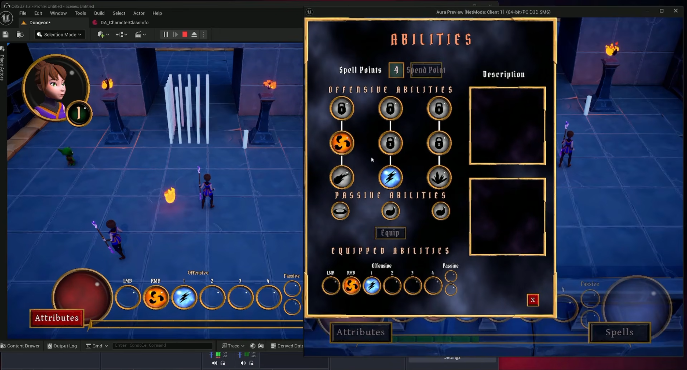

# Aura - Multiplayer Top-Down ARPG (UE5 / C++)

A playable top-down action RPG built in Unreal Engine 5 and C++, centered on the
Gameplay Ability System (GAS) with network replication and a data-driven setup.

Built by following Stephen Ulibarri's UE5 GAS course, with my own changes to the
code along the way. This README documents how the systems fit together.

A Listen Server and a Client on the screenshot:


## Current state.
Single-player, including the main menu and save/load, works end to end. Multiplayer worked throughout the GAS part of the project, but the menu added at the end of the course loads the level locally, so the host doesn't carry connected clients with them and they end up in separate worlds. Fixing it properly means routing the map load through server travel and reconciling the save system with replication, which I haven't done yet. The gameplay video and the screenshot are from a build before that change.

## Tech

UE5, C++17/20, clang-format, Gameplay Ability System, Replication, Data Assets, Gameplay Tags,  MVC-style widget controllers

## Architecture

### Input

Input is bound through gameplay tags rather than hardcoded per-action functions.

`UAuraInputConfig` is a Data Asset holding `TagsToInputActions` - an associative
map filled in the asset itself, so every button has an `InputAction` paired with
an `FGameplayTag`.

Three callbacks take an `FGameplayTag InputTag` as their argument:
`InputPressed`, `InputReleased`, `InputHeld`.

In `APlayerController::SetupInputComponent` the config is iterated once, and all
three callbacks are bound to each `InputAction` with its corresponding tag. Adding
a new bindable action means editing the Data Asset, not the Controller.

### Ability activation

My base ability class is `UAuraGameplayAbility`. It carries an `FGameplayTag InputTag` that says which `InputAction`
should run it.

On a button press the callback fires with its `InputTag`. Activatable abilities are
iterated, and the one whose `InputTag` matches is activated.

### Ability execution

```
Button press
  -> input callback (carries InputTag)
  -> matching ability activates
  -> commit cost and cooldown
  -> play montage
  -> AN_MontageEvent (anim notify) calls SendGameplayEvent
  -> ability, which has been waiting for that gameplay event, runs its logic ( e.g. spawning FireBall )
```

Routing the payload through an animation notify keeps the effect timed to the
animation instead of to activation, so a projectile leaves the hand on the frame
the artist chose.

### Damage pipeline

My base damage ability `UAuraDamageGameplayAbility` owns all the attack data - damage, debuff chance, crit rate and so on -
plus a damage effect class (`GE_Damage`) and a projectile class.

```
Ability spawns projectile, attaching a GameplayEffectSpec to it
  -> projectile collides with an enemy
  -> GE_Damage is applied
  -> ExecCalc_Damage reads the damage-related attributes (damage, defense, ...)
  -> calculates final damage and debuff
  -> writes the result into the IncomingDamage attribute
  -> UAuraAttributeSet applies it to Health and broadcasts widget notifications
```

The projectile itself carries no damage logic - it only transports a spec. All damage calculation stays in one place (ExecCalc_Damage), shared by every damage ability. That keeps it easier to follow and expand.
And since the effect is applied on the server, the calculation is server-authoritative by construction ( only the resulting attribute values replicate, not intermediate damage numbers scattered across actors ).

### Character attributes

**Primary** - four base attributes: Intelligence, Strength, Vigor, Resilience.

**Secondary** - derived from the primary ones. They are driven by an Infinite
Gameplay Effect, so any change to a primary attribute recalculates them
automatically rather than through manual update calls.

### Widgets (MVC)

Widgets never touch the ability system directly. Each one has its own
WidgetController, which owns the data and the bindings.

Spending a point on Intelligence, for example, goes:

```
Widget broadcasts to its WidgetController
  -> UAuraAbilitySystemComponent::ServerUpgradeAttribute_Implementation
  -> server sends a gameplay event to the ASC
  -> GA_ListenForEvents (an infinitely running ability) picks up events tagged "Attribute"
  -> sets magnitude by caller for that tag and applies GE_EventBasedEffect
  -> the effect modifies the primary attribute and IncomingXP
  -> OnAttributeInfoChanged broadcasts
  -> Lambdas from UAuraAttributeWindowWC::BindCallbacksToAttributeChanges update the Widget
```

The upgrade is applied to the ASC on the server, so the client is asking rather than
deciding, and the UI reacts to the resulting attribute change instead of assuming
it succeeded.

## Where to look in the code

Unreal projects browse badly on GitHub, since most of `Content/` is binary. These
are the files worth opening first.

| File | What it shows |
| --- | --- |
| [`AuraInputConfig.h`](Source/Aura/Public/Input/AuraInputConfig.h) | Tag-to-InputAction Data Asset that drives all input binding |
| [`AuraPlayerController.cpp`](Source/Aura/Private/Player/AuraPlayerController.cpp) | Where the config is iterated and the three tag callbacks are bound ( AAuraPlayerController::SetupInputComponent -> UAuraInputComponent::BindAbilityActions ) |
| [`AuraAbilitySystemComponent.cpp`](Source/Aura/Private/GAS/AuraAbilitySystemComponent.cpp) | Ability activation by input tag (UAuraAbilitySystemComponent::AbilityInputTagPressed), attribute upgrade function which calls server-side logic ( UAuraAbilitySystemComponent::UpgradeAttribute ) |
| [`ExecCalc_Damage.cpp`](Source/Aura/Private/GAS/ExecCalc/ExecCalc_Damage.cpp) | Damage and debuff calculation from captured attributes ( UExecCalc_Damage::Execute_Implementation ) |
| [`AuraAttributeSet.cpp`](Source/Aura/Private/GAS/AuraAttributeSet.cpp) | Primary and secondary attributes, applying incoming damage |
| [`AuraAttributeWindowWC.cpp`](Source/Aura/Private/UI/WidgetController/AuraAttributeWindowWC.cpp) | Widget controller and the attribute-change bindings ( UAuraAttributeWindowWC::BindCallbacksToAttributeChanges ) |

## Building

Requires Unreal Engine 5.5.
Open `Aura.uproject` and let the editor compile the sources when prompted.